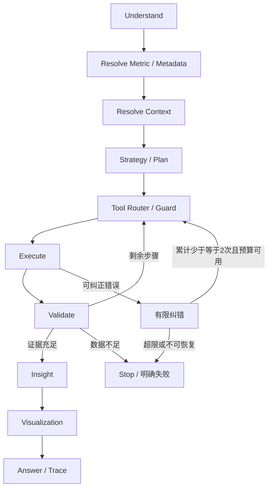

# InsightAgent Agent与工具设计

> 文档修订 v1.1 · 2026-10-01。需求来源为用户提供的《智能数据分析 Agent 平台 PRD v1.0》；实现建议与产品要求分别标注。本文描述目标设计，不代表功能已实现。

## 1. 控制原则

使用LangGraph实现**受控分析框架 + LLM动态规划**。系统规定允许的指标、数据源、Tools、策略与权限；LLM在这些范围内规划顺序、过滤与下钻。MVP不是无限自由探索，不提供任意代码执行或自主更改指标。

标准路径：问题理解→指标解析→上下文解析→策略/规划→工具路由→执行→结果验证→洞察→可视化→最终回答。语义层优先；RAG补充规则和SOP，不能覆盖正式指标。

## 2. 状态与图

`AgentState`实现约定：user_id/session_id/analysis_id/trace_id、question/language、intent、data_source、metrics及版本、dimensions、time_range/comparison_range、filters、context、strategy、plan、current_step、tool_calls、sql/python、result_refs、quality_warnings、insights、chart_specs、errors、correction_count、step_count、token_usage、status。

状态只存必要摘要及结果引用，不把大量原始数据或敏感字段写入Prompt。用户新条件覆盖继承值；年份不明确且会话/页面没有明确期间时请求澄清，不能默认系统当前年份。

## 3. 六种Tool契约

工具公共输入包括授权身份、数据源和analysis/trace关联；公共输出包括status、结果引用、口径/版本、执行耗时、警告与结构化错误。所有输出经验证才作为结论证据。

| Tool | 输入 | 输出/职责 | 边界 |
|---|---|---|---|
| SQL | 受授权SQL、参数、超时/行数限制 | 多表JOIN、趋势、TopN、同比环比、聚合与贡献数据 | 只读；SQL生成与执行分离；用户编辑SQL经过同一安全入口 |
| Python | 查询结果引用、分析方法/经过校验的代码与参数 | Pandas/NumPy统计、贡献、Pareto、异常检测、派生数据 | 可查看不可修改执行；限制数据量/耗时/导入与外部访问；不修改原业务数据 |
| Metric | metric_code、期间、维度、过滤 | 正式定义/版本、单位、粒度、允许维度、可执行查询约束或聚合结果 | 首先使用默认标准口径，歧义需选择；草稿不可自动发布 |
| Metadata | 授权数据源、表/字段/关系请求 | Schema、字段业务含义、键/粒度、可用指标/维度 | 只返回已授权对象；不能泄露黑名单字段 |
| Analysis Strategy | intent、指标、可用维度、问题上下文 | 销售下降归因、客户贡献、产品结构的受控步骤模板 | 三种首批策略；LLM可调整顺序/筛选，不新增业务领域 |
| Visualization | 已验证结果、字段类型、分析目的、图表偏好 | ECharts图表规格，Line/Bar/Pie/Scatter/Waterfall/Pareto | 数据来自结果引用；允许类型切换、X/Y、TopN、排序/筛选；无拖拽BI或自然语言改图 |

## 4. 主Demo策略

1. 解析销售额、有效订单、确认日期口径及目标 2011 年 2 月；选择 2011 年 1 月作为参照，检查数据完整性。
2. 查询趋势、金额差及环比/同比；未下降则说明事实，不硬套“下降原因”。结合季节性与质量判断异常证据。
3. 分别按客户、产品、区域计算本期/基期差额，保留消失及新增对象，按负向影响排序。
4. 对主要客户和产品交叉分析，确认客户 × 产品组合贡献；比较数量、成交价与毛利变化。
5. 生成贡献/趋势/结构图表、可解释经营结论、质量风险及证据引用；建议只在数据支持的范围提出，不编造客户取消采购的外部原因。

### 贡献计算约定

某个不重叠维度内，Δ_i=S本期_i−S基期_i，总Δ=ΣΔ_i。以完整对象集合FULL OUTER JOIN，缺失对象金额按0处理，不仅查询本期TopN。Δ_i/总Δ为有符号净变动贡献率；上涨项可负贡献，负向项可能超过100%，必须解释抵消效应。总Δ=0时不计算比例。

客户、产品、区域是同一变化的不同视角，不能跨维度累加贡献。客户×产品用于验证交叉来源，不再次计入已汇总总额。Waterfall需有起点、各差额与终点；TopN未覆盖部分汇为“其他”。

数量/价格拆解优先同一产品/同单位：ΔS≈(Q1−Q0)P0 + Q1(P1−P0)，其中P为量加权成交价；按行舍入造成残差应单列。产品组合变化及毛利下降分别解释，不能把毛利下降直接当销售额下降。无成交或分母零时不虚构平均价格。

## 5. SQL安全

结构解析与允许列表阻断非只读表达式、多语句、写入CTE、DDL/DML、SELECT INTO、危险函数及越权对象；SELECT开头不代表安全。执行层使用数据库只读账号/事务，配置statement timeout和最大返回行数。敏感字段禁用覆盖查询、元数据、Prompt、表格和报告。

安全拒绝不能通过“自动纠错”绕过权限。展示给分析师的SQL可编辑，重跑仍由后端验证并保留版本。SQL结果截断必须提示，不能用截断样本计算全量贡献。

## 6. 结果验证与纠错

验证指标版本、期间/过滤一致性、金额/贡献对账、列类型、空结果、分母零、重复JOIN、结果截断及数据质量。失败不能生成确定结论。

**每次分析运行SQL/Python自动纠错累计最多2次**，首次执行不计纠错，单个失败动作最多形成首次+2次尝试；不同工具不重置计数。错误信息先脱敏，修正后重新经过权限/安全校验。超限、数据不足、权限拒绝或预算耗尽则停止，返回已完成步骤、未完成部分与明确原因。用户主动发起新运行另建run/Trace，不能用内部重启规避限制。

最大Agent Step、Token/查询成本配置；原 PRD 建议8–10Step需按实际工具调用与主Demo验证确定计数定义，不能因图节点跳转数量使必需步骤不可执行，也不能以循环逃逸预算。

## 7. 上下文与RAG

会话保存指标、期间、过滤、维度、数据源和当前验证结果。问题“只看高毛利产品”需明确高毛利阈值或已有业务规则，不能编造阈值。不同会话不自动继承；分析资产只能显式打开。

知识库支持PDF、DOCX、Markdown、Excel，轻量检索指标说明、业务规则、分析SOP、产品/客户分类。返回文档/片段来源；文档中的指令不可提升工具权限。未检索到规则时说明缺口，不能拿Ground Truth充当知识。Embedding型号、TopK、切分参数待配置。

## 8. Trace与评估

每一步记录step_id、计划目的、工具/参数摘要、SQL/Python、结果引用、图表、模型、Token、耗时、错误、重试、指标/数据版本；输出可查看执行摘要，无需存储模型隐含思考。

20～30个标准问题覆盖五类，建议30题；另设安全及工程回归用例；每题记录正确口径/SQL或等价结果、数值、工具路径、Ground Truth命中与失败原因。包括大客户/产品变化、跨会话隔离、缺失数据、零基数、恶意SQL、超时及纠错上限。只有实际结果可复算才判正确；不以语言流畅度代替归因正确性。见 [DEVELOPMENT_PLAN.md](DEVELOPMENT_PLAN.md)。

## 9. 工具执行与版本更新细则

授权身份由服务端绑定；LLM不能传入或覆盖用户身份及权限。SQL生成节点结合Metric/Metadata生成查询，再交给SQL Tool校验执行，生成器不是第七种Tool。

Step建议按一次工具调用计数；纠错重试同样消耗Step，并另受最多2次累计纠错约束。LLM规划/回答调用独立受Token与模型调用预算约束。初始目标为8～10次工具调用，最终上限由主链实测配置；数据库可在一次受控查询中返回多项聚合，不能为了预算省略必需证据。

Python建议优先使用受控分析函数生成可查看代码；若执行模型生成代码，应在独立受限进程中限制网络、文件访问、导入、内存及耗时。实际执行路径必须明确，不能把代码文本过滤等同于隔离。展示代码须与实际执行一致。

SQL编辑重跑创建新运行与版本，原结果保持不变。所有依赖该查询的贡献、图表和结论需重新验证或标记失效；指标/期间改变时同步上下文。报告只能引用同一已验证版本，不能将新SQL结果与旧结论组合。
