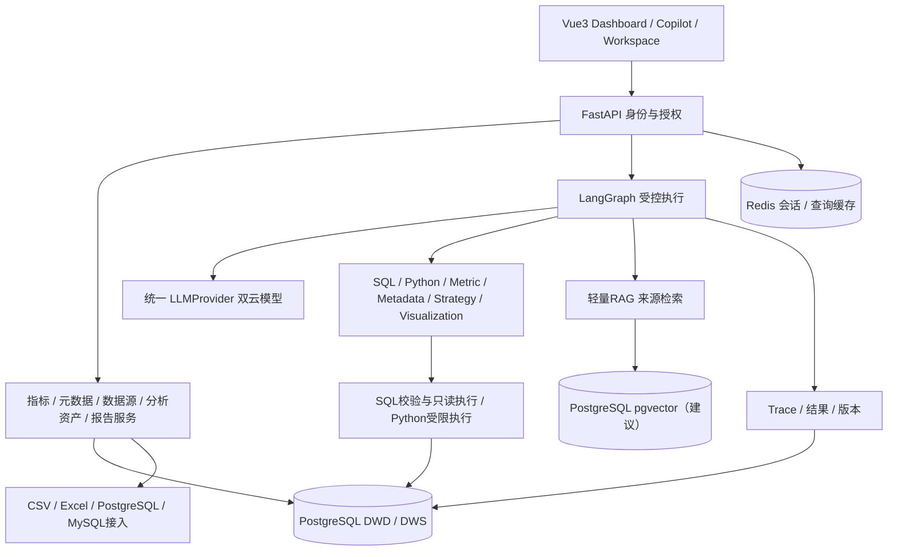

# InsightAgent 系统架构

> 文档修订 v1.1 · 2026-10-01。需求来源为用户提供的《智能数据分析 Agent 平台 PRD v1.0》；实现建议与产品要求分别标注。本文描述目标设计，不代表功能已实现。

## 1. 架构范围

MVP 为本地运行的前后端分离应用，PostgreSQL 保存业务数据和分析资产，Redis提供会话上下文及查询缓存，向量存储用于轻量 RAG（建议采用pgvector）。采用受控分析框架 + LLM动态规划。完整数仓、云部署、多租户不进入本阶段。

## 2. 技术分工

| 层 | 技术 | 职责 |
|---|---|---|
| 前端 | Vue3、TypeScript、Vite、Pinia、Vue Router、Element Plus、ECharts | 三类核心界面、路由/状态、表格与图表、权限入口 |
| API | FastAPI、Pydantic | 请求/响应契约、认证授权、参数/结果校验 |
| 数据访问 | SQLAlchemy、PostgreSQL | 服务数据访问、业务事实/汇总、指标及分析资产 |
| 缓存 | Redis | 会话上下文与授权隔离的查询缓存；Day1可暂不启用 |
| Agent | LangGraph、LLMProvider | 显式状态、计划、工具路由、验证、有限纠错 |
| 数据分析 | Pandas、NumPy、scikit-learn | MVP使用统计和贡献计算；scikit-learn保留在技术栈，ML异常检测延期 |
| RAG | Embedding、向量存储（建议pgvector） | 文档切分、向量检索、来源追踪；模型与维度待配置 |

## 3. 服务与模块边界

- `api/`：auth、dashboard、customers、products、metrics，以及数据源、会话、分析、报告、知识、Trace的最小接口。具体接口分组为实现拆分约定，不是新增功能。
- `services/`：MetricService、MetadataService、DataSourceService、质量检查、分析资产和报告服务；`repositories/`使用受控身份访问数据。
- `agents/`：LangGraph状态与节点；`tools/`暴露六种能力；`semantic/`维护指标口径；`rag/`处理知识检索。
- `models/`、`schemas/`：数据库及Pydantic模型；`core/`：配置、权限、安全、LLMProvider。
- `data/raw/seed/generated/scripts/`：原始、种子、生成数据及可重复脚本；`database/`维护初始化和后续迁移；`tests/api/agent/`保存校验与评估；`prompts/`保存提示模板。

## 4. 数据接入路径

CSV/Excel：上传→解析→字段映射→类型与基础质量检查→进入可分析数据。PostgreSQL/MySQL：配置→测试连接→获取授权Schema/表/字段→语义映射→受控只读查询。内部主 Demo采用 PostgreSQL标准模型，MySQL支持接入与查询，不要求重建第二套主 Demo。

文件解析/导入使用专用服务写入身份；Agent SQL连接仅只读。外部数据必须具有可用字段和明确口径，不能承诺任意表自动完成半导体归因。适配SQL方言，客户端不能直接提交任意连接凭据到LLM。无自动同步、无实时 CDC。

## 5. 执行与信任边界

每次请求先认证，再确定可用数据源、表和字段。Metadata/RAG检索、SQL校验、结果展示及报告导出均遵守同一授权，前端隐藏按钮不能代替后端权限。

SQL执行结合结构解析校验、允许对象列表和数据库只读账号/事务；禁止DDL/DML、多语句、写入CTE、SELECT INTO及危险函数。参数化业务过滤，设置超时/返回上限。Python只使用授权查询结果、经过限定的分析能力及资源边界，不提供用户任意代码执行。

LLM可生成计划和草稿，实际执行由后端校验。知识文件和数据库文本按数据处理，不能更改工具权限或覆盖系统约束。RAG提供业务规则证据，语义层提供正式指标定义。

## 6. 会话、缓存与资产

会话键绑定用户和session_id，保存当前指标、期间、比较期间、过滤、维度、数据源及已验证结果引用。会话内继承明确条件，用户新条件覆盖旧条件；不同会话不自动合并记忆。

缓存键至少含数据源、数据版本、指标版本、查询/参数及授权范围；更新数据、口径或授权后失效。外部数据库未提供可靠数据版本时，采用短TTL并允许关闭缓存，不把TTL视为版本保障。

### 分析版本和重放

- `analysis_id` 标识资产，`run_id` 标识一次执行，`version_id` 标识已保存版本，`trace_id`关联证据；会话上下文可放Redis，保存的资产和版本必须持久化。
- 每个关键版本保存原问题、执行计划、SQL及参数、实际执行Python、指标版本、数据源/批次版本、时间/过滤、完整授权结果快照（受存储配额限制）、图表规格、已验证结论和质量报告引用。快照保存在本地受控目录，数据库保存清单、校验和与路径；权限覆盖文件下载。
- 结果快照用于展示原分析及生成同版报告。超出配额必须明确提示并标记不可完整保存，不能以静默截断结果继续计算全量贡献。SQL编辑重跑生成新版本，并更新或作废依赖的图表/结论。
- 主Demo数据在验收时冻结为一个数据版本，保存生成器版本、种子、配置、原始参考数据校验和及导出备份；在同版指标/执行逻辑下重放，数值按指标精度对账。
- 外部可变数据库默认只保证保存结果可查阅；没有冻结源或完整查询输入快照时，重新查询使用当前数据并生成新版本，不能承诺历史数据重算。
- 删除资产按引用关系清理快照；读取、复制、导出及报告重新校验用户权限。凭据仅存受控配置引用，不能写进快照或Trace。

### 分析运行状态

建议运行状态为pending/running/succeeded/failed/cancelled，保存当前步骤及错误。前端至少支持加载状态、步骤查看、失败说明和终止运行。初版可使用后台任务加轮询；SSE/WebSocket及专用任务队列按实际需求选择，属于实现建议。停止后不再启动后续工具，已运行查询由超时或取消机制回收。

## 7. API契约与可观测性

接口统一返回结果状态、数据/图表/结论、口径与期间、质量提示、analysis_id/session_id/trace_id及结构化错误。具体路由与传输方式在开发时细化，传输方式采用第6节建议，最终按运行耗时验证。

Trace记录计划、步骤、工具、SQL/Python、结果摘要、图表、回答、模型、Token、耗时、错误及重试。日志和导出不含密码、密钥或敏感字段。记录版本及查询条件，以支持复算。

## 8. 部署与待配置项

MVP本地启动 PostgreSQL/Redis、FastAPI与Vite；LLM及Embedding凭据使用环境配置。Docker、云服务器、CI/CD在第二阶段。两个云模型的供应商/型号、Embedding模型/维度、超时/行数/Step与缓存参数尚未锁定，不安装或承诺特定模型。

数据关系见 [DATA_MODEL.md](DATA_MODEL.md)，Agent契约见 [AGENT_DESIGN.md](AGENT_DESIGN.md)，边界见 [DECISIONS.md](DECISIONS.md)。
