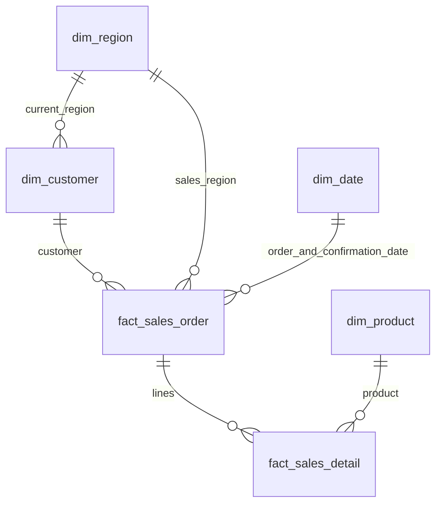

# InsightAgent 数据模型与指标口径

> 文档修订 v1.1 · 2026-10-01。需求来源为用户提供的《智能数据分析 Agent 平台 PRD v1.0》；实现建议与产品要求分别标注。本文描述目标设计，不代表功能已实现。

## 1. 基线与分层

现有 `database/schema.sql` 提供六张核心表；本文件补充确认日期、DWS和语义层的目标设计，尚需迁移落地。本文件不声明数据库已经初始化成功。MVP采用星型分析模型，重点 DWD + DWS + Semantic Layer；不扩建完整 ODS/ADS体系。



明细冗余customer_id/region_id/order_date，通过与订单头复合外键保持一致。客户当前区域不替代订单历史成交区域。订单与明细同事务写入，导入后检查空订单；关联订单头不能引入一对多金额重复。

## 2. 核心表字典

| 表 | 粒度与键 | 字段与约束 |
|---|---|---|
| dim_customer | 每客户一行；customer_id bigint PK；customer_code唯一 | customer_name、industry、customer_level、region_id FK、acquisition_date、is_active；行业/等级当前值覆盖 |
| dim_product | 每产品一行；product_id bigint PK；product_code唯一 | product_name、product_line、product_category、unit、standard_price/standard_cost numeric(18,4)≥0、is_active |
| dim_region | 每销售区域一行；region_id bigint PK；region_code唯一 | region_name、country_name、province_name、city_name、is_active |
| dim_date | 每自然日一行；date_id date PK | year/quarter/month/day、iso_year/iso_week、day_of_week、is_weekend自动计算；is_holiday手工日历标记 |
| fact_sales_order | 每订单一行；order_id bigint PK；order_number唯一 | customer_id、region_id、order_date分别引用维度；目标增加 confirmed_date（可空，引用dim_date）；order_status为pending/completed/cancelled；created_at；无独立订单金额 |
| fact_sales_detail | 每订单行一行；order_detail_id bigint PK；(order_id,line_number)唯一 | order_id、line_number>0、customer_id、product_id FK、region_id、order_date、quantity整数>0、unit_price/standard_cost numeric(18,4)≥0；四项生成指标见下 |

明细金额使用 numeric(24,2)，毛利率 numeric(18,6)。`unit_price`为折扣后成交价，明细`standard_cost`为成交时单位成本快照；产品当前成本修改不影响历史利润。产品在同一订单可多行，不能以order_id/product_id假定唯一。

## 3. 统一业务口径

原 PRD 要求“订单确认后的不含税销售金额”。目标设计以订单头 `confirmed_date` 归属销售期间；`order_date` 保留订单发生日期。现有 schema 尚无 `confirmed_date`，不能据此宣称已满足确认口径。

MVP 状态映射建议：`completed` 表示有效已确认订单，必须有确认日期；`pending` 未确认，日期为空；`cancelled` 不进入销售统计。本阶段不处理部分确认、确认后退款或状态变更会计追溯。确认订单金额仍不是完整财务收入确认。

迁移规则：订单头增加 `confirmed_date` 及状态/日期约束、日期索引；明细不必冗余确认日期，关联订单头过滤和分组即可。模拟数据在生成时明确生成确认日期；可先令其等于订单日期，但必须记录这一模拟假设。外部数据缺少确认日期时，应要求映射或显式选择替代口径并使用不同指标版本，不能静默回填。

模拟数据建议统一人民币、不含运费；免费样品允许零单价、负毛利允许。退货/退款、多币种、慢变维度属于当前模型之外的能力。

设 S=销售额，Q=销量，C=成本额，G=毛利，O=有效订单数，N=有效客户数。默认统计completed且确认日期有效的订单；期间采用 `confirmed_date >= start AND confirmed_date < end`，月份用月首date。图表、DWS、同比环比、首购月份和报告统一使用确认日期。

| 指标代码 | 指标与公式 | 口径注意事项 |
|---|---|---|
| sales_amount | Σ行销售额；行=round(quantity×unit_price,2) | 金额先逐行四舍五入再求和 |
| quantity | Σquantity | 产品计量单位一致；跨单位不能盲目合计 |
| order_count | COUNT(DISTINCT order_id) | 明细粒度去重，不能COUNT(*) |
| customer_count | COUNT(DISTINCT customer_id) | 当期有效成交客户，不等于客户主档数量 |
| avg_selling_price | S / Q | Q=0返回NULL，量加权售价 |
| cost_amount | Σround(quantity×历史standard_cost,2) | 不回查产品当前成本 |
| gross_profit | S−C | 按行生成后汇总 |
| gross_margin | G / S | S=0返回NULL；禁止平均行毛利率；0.25展示25% |
| avg_order_value | S / O | 本基线“客单价”指每订单金额；每客户收入S/N需另名，禁止混用 |
| customer_contribution_rate | 某客户S / 同范围全部客户S | 分母保留期间/区域/产品条件，去除客户筛选；展示分母范围 |
| sales_mom | (本期S−上期S) / 上期S | 完整月对完整月；分母0/缺失返回NULL并解释 |
| sales_yoy | (本期S−去年同期S) / 去年同期S | 同长度期间，不把不完整月份同比当完整月 |

客单价、新老客户规则等是执行口径约定，若业务方改变必须新增版本并回归。新客户按首笔有效订单确认月份识别，获客日期是主档属性，不能直接等价首购。TopN排序规则保持确定性；贡献率和集中度必须显示总体范围。新客量、Top5集中度为客户策略派生统计，不强制扩增核心指标数量。

## 4. DWS设计与可加性

以下为数据阶段待实现结构，统一只纳入completed订单。

| 表 | 唯一粒度/键 | 建议保存基础量 |
|---|---|---|
| dws_sales_monthly | month（月首date） | sales_amount、quantity、cost_amount、gross_profit、order_count、customer_count |
| dws_customer_monthly | (month,customer_id) | sales_amount、quantity、cost_amount、gross_profit、order_count |
| dws_product_monthly | (month,product_id) | sales_amount、quantity、cost_amount、gross_profit、order_count、customer_count |

比率查询时由基础量重算，不能平均月毛利率。销售额、成本、销量可在一致单位和不重叠粒度上相加；产品订单数/客户数不能跨产品直接相加，月份客户数不能跨月相加；季度/年去重回事实层。整体DWS没有区域或客户×产品粒度，这两类归因回到明细，不新增必需汇总表。

刷新由生成/导入流程显式触发，记录数据版本并做金额、数量、毛利与去重对账；定时同步延期。现有日期/客户/产品/区域索引支撑查询；仅在查询证据需要时优化，不先引入分区或新数据库。

## 5. 指标语义层

`metric_definition`至少包含metric_id/code/name、description、formula、source_table/field、aggregation、unit、time_granularity、dimensions、default_filter、business_definition、owner、status；补充version及零分母规则用于可复算。公式是受控表达式或模板，不允许配置任意写入SQL。

Metadata维护表/字段中文解释、类型、粒度、JOIN键、可用维度、权限与敏感标记。Dashboard、Agent、报告共用MetricService。自然语言只生成指标草稿，人工确认保存，不能静默改变正式口径。

## 6. 生成数据与Ground Truth

原PRD范围：3年，30–50万明细、8–12万订单、500–1000客户、200–500产品、10–20区域；建议默认800/300/15。当前公开数据 Demo 使用 2011 年 1 月和 2 月作为比较期间；后续切换模拟数据时再由配置指定目标月份。

每个异常保存scenario_id、期间、作用对象、注入前基线、变动规则、预期定位、验证SQL、实际生成后的差额/贡献、种子和数据版本。八类场景见 [PRD.md](PRD.md)。具体客户、产品、异常幅度和最终贡献均由生成配置与验证结果确定，不能预填答案。

Ground Truth只用于评估，不能送入Agent/RAG充当答案。脏数据放原始输入样本，经过质量检查后再导入：不为了注入错误取消事实表约束。异常之间可能相互影响，应验证最终数据而非只记录注入参数；季节性同时作为对照避免误报。

## 7. 目标模型对账查询示例

以下 SQL 依赖确认日期迁移，不能直接用于现有 schema。

```sql
SELECT date_trunc('month', o.confirmed_date)::date AS month,
       SUM(d.sales_amount) AS sales_amount,
       SUM(d.gross_profit) AS gross_profit,
       SUM(d.gross_profit) / NULLIF(SUM(d.sales_amount), 0) AS gross_margin,
       COUNT(DISTINCT d.order_id) AS order_count,
       COUNT(DISTINCT d.customer_id) AS customer_count
FROM fact_sales_detail d
JOIN fact_sales_order o ON o.order_id = d.order_id
WHERE o.order_status = 'completed' AND o.confirmed_date IS NOT NULL
GROUP BY 1
ORDER BY 1;
```

## 8. 应用数据边界

除九张业务表外，MVP需要指标定义、用户/角色/授权、数据源配置、会话、分析/版本、Trace/工具记录、知识文档/片段、质量结果及反馈的应用存储。仅作为原 PRD 明确要求的功能的支撑模型；确切表名与字段在对应工作日落地，不能宣称现有schema已包含这些表。向量维度跟随选定Embedding配置，凭据不进入日志或Agent上下文。

## 9. 数据质量与结果解释

原始文件、被拒绝记录和可分析数据分开保存。质量记录至少包含批次、字段/规则、检查总数、受影响数、缺失/拒绝数、处置及期间范围。导入校验从数据接入阶段开始，后续再补展示和高级统计。

清洗后数据仍需关联原始批次质量报告。删除缺失记录不代表期间完整：回答应报告剔除数量及影响范围。源系统未提供应有记录数时只能说明已观察到的问题，不能编造“缺失率”。缺少某月数据不等于该月销售额为零。

数据版本与分析快照的实现见 [系统架构](ARCHITECTURE.md) 第 6 节。
